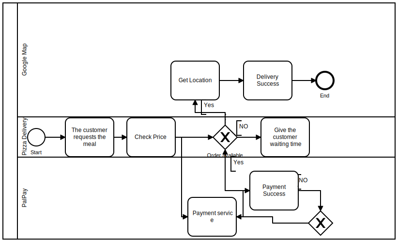

# Pizza delivery servic

 <h1> Abstract <h1/> 
 
The user orders a pizza meal from the restaurant application and then Google Maps is called to locate the customer and after the customer's approval the payment service is called
<ul>
  <li> Get Location (Google maps API )
 <li> Payment (PalPay API) </li>
</ul>
 

<h3> SOA </h3>
 
<h3> BPMN </h3>
 
